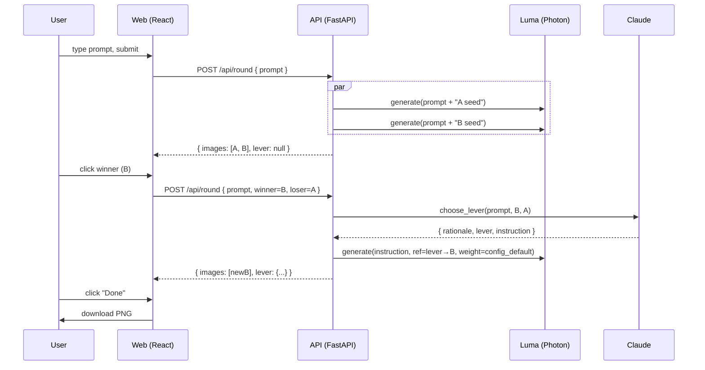

# image-morpher prototype — implementation plan

A weekend-scope prototype. User types a prompt → two parallel Photon
generations → click winner → an LLM proposes which Luma reference
channel (`style_ref` / `character_ref` / `modify_image_ref`) to use
for the next round → user can override → repeat → "Done" → PNG
download.

Audience: designers / mood-board creators iterating 8–15 rounds on a
single image. See `docs/project-brief.md` for product context.

Stack: React + Vite + TypeScript (frontend), Python + FastAPI +
`lumaai` SDK + `anthropic` SDK (backend). Localhost only.

## Problem frame

Generative image refinement loses what made earlier outputs good.
Existing tools either start from scratch on every regeneration
(Midjourney) or expose reference images without telling you when each
kind is right (Luma's API itself). Hypothesis: when a user prefers B
over A, the *kind* of preference signal (visual style, subject
identity, surgical change) maps to a different Luma reference channel,
and an LLM looking at both images can route that signal. The prototype
is the apparatus to test that hypothesis; the artifact is the running
code plus the findings logged in `NOTES.md`.

## Requirements trace

**Core A/B loop**

- **R1.** Text prompt → two parallel Photon generations on round 0.
- **R2.** Click-to-pick A/B UI on every round.
- **R3.** Anchored loop: winner persists as A; one new candidate B is
  generated each subsequent round.

**LLM reasoning**

- **R4.** LLM lever-selection per round, returning JSON
  `{rationale, lever, instruction}` with `lever ∈ {style_ref,
  character_ref, modify_image_ref}`. Per-lever weight defaults live in
  config (Decision 3).
- **R5.** LLM lever and rationale revealed *after* B generates,
  surfaced via plain-language label (Decision 6). Override dropdown
  applies to the next round, not the current one — the user's escape
  hatch when Claude misroutes.

**Ship and findings**

- **R7.** "Done" button → PNG download. No social share.
- **R9.** Clone-and-run setup: `uv run` (backend) + `npm run dev`
  (frontend); README only.
- **R10.** A designer can run 10+ rounds in one session without the
  loop drifting away from what they liked. Per-round latency feels
  like part of the craft, not a wait.
- **R11.** `NOTES.md` captures ≥5 substantive findings about Photon /
  UNI-1 behaviour, with the strongest finding leading. Includes a
  one-line read on whether the loop converged or drifted during the
  Unit 6 smoke.

## Out of scope

From the brief's "v2 ideas" list:

- Ray 2 video output, image-to-video finalise
- User-uploaded starting images (would need CDN hosting)
- PDF export, branching from history, accounts, hosted deploy
- Speculative pre-generation of round N+1 to mask latency
- Mobile-first design (mobile layout is best-effort)
- Linter / formatter / mypy — one person, two weekends

Cut from a wider draft, parked as v2 candidates if the MVP earns
them:

- **Preference chip** (`mood` / `subject` / `composition` / `bolder`)
  feeding the lever prompt — was insurance against an unproven risk;
  add only if Unit 6 shows the LLM-alone path is wobbly.
- **"Both bad" re-roll button** — escape hatch; substitute is "pick
  the less-bad one and override for next round", or click Done.
- **History rail** with thumbnails + lever badges — visual progress
  indicator; the active pair is the only thing that affects outcomes.
- **Demo GIF in the README** — fast-follow once the prototype ships;
  record a 10-pick session and embed at the top of `README.md`.

## Commands

```
backend (api/):  uv sync · uv run uvicorn app.main:app --reload --port 8000 · uv run pytest
frontend (web/): npm install · npm run dev · npm run test · npm run build · npm run typecheck
spike (spike/):  uv run python spike/spike.py
```

Tests: `pytest` + `pytest-asyncio` + `respx` on backend; Vitest +
React Testing Library on frontend. No e2e — Unit 6's manual smoke is
the end-to-end check.

## Code style

- Python 3.11+, type hints, pydantic for cross-boundary payloads,
  `async def` for SDK calls. Errors are explicit exception classes,
  translated to typed `ErrorResponse` at the FastAPI handler.
- TypeScript strict mode. `useState` + prop drilling — no reducer, no
  Redux, no Zustand. Plain CSS — no Tailwind.
- `web/src/types.ts` mirrors `api/app/models.py` by hand. Drift is
  the most likely contract bug; keep both in PR scope when either
  changes.
- Comments explain *why*. One file per concern; don't preemptively
  split into packages.

## Boundaries

Sunday-afternoon-when-scope-creep-is-loud rules:

- Don't commit `.env` or anything containing API keys.
- Don't add a state library, UI kit, or CSS framework.
- Don't ship features outside this plan or the brief's "v2 ideas".
- Don't build a backend image proxy until Luma URL TTL actually bites.
- Run the spike (Unit 1) before writing any backend code.

## Decisions worth remembering

1. **Single endpoint.** `POST /api/round` handles both round-0 and
   round-N off the request shape (`winner_url is None` → round 0).
   Cuts duplicate client logic.
2. **Override skips Claude.** Synthetic `LeverChoice` built from the
   request; no LLM call. Acceptable cost: override mode produces
   near-identical outputs round-over-round (only the channel changes).
3. **`weight` is not asked of the LLM.** Per-lever defaults in
   `config.py`: `WEIGHT_STYLE_REF` (initial 0.55, refined in Unit 1)
   and `WEIGHT_MODIFY_IMAGE_REF` (0.85). `character_ref` has no
   weight in the SDK and is silently exempt.
4. **`instruction` becomes the Photon `prompt` on every round-N
   call.** The system prompt must require a self-contained image
   prompt (e.g. *"a vintage typewriter on a wooden desk in moodier
   lighting"*), never a constraint description. Constraint phrasing
   becomes the literal Photon prompt and loses the original subject.
5. **Round-N response carries only the new B URL.** Frontend retains
   the prior winner from local state. Backend is stateless.
6. **Plain-language lever labels in the UI.** `style_ref` → "Keep the
   look", `character_ref` → "Keep the subject", `modify_image_ref` →
   "Tweak it". Translation table in
   `web/src/components/LeverSubtitle.tsx`. API strings never reach
   the user.
## Open questions to validate while building

- **Round-0 variance.** Does Photon return materially different
  images on identical prompts? If not, append distinct semantic
  seeds (`"warm lighting"` / `"cool lighting"`) — neutral nonces may
  collapse to the same latent.
- **`style_ref` weight calibration.** What value feels like "carry
  the vibe" vs "near-duplicate"? Calibrate empirically; bake into
  `config.py`.
- **Image URL TTL.** Do Luma URLs survive ~30 min? If shorter,
  document in README; do not build a proxy.

Loop convergence and latency-feel are answered by *using* the
prototype during Units 5/6 — log surprises in `NOTES.md`.

## High-level design

### Round flow



### Frontend state machine

```
idle ──[submit]──▶ generating
generating ──[ok]──▶ picking
picking ──[click winner]──▶ generating  (sends pendingOverride if set)
picking ──[click "Done"]──▶ done
generating ──[error]──▶ error ──[retry]──▶ generating
```

In `picking`, the override dropdown is input-only. `pendingOverride`
resets after each round-N submit.

## Implementation units

### Unit 1: Spike (Day 0 precondition)

Single-file Python spike. Validates the round-0 → lever → round-1
loop end-to-end before any backend code. Acts as the go/no-go gate
on the core hypothesis.

Files: `spike/spike.py`, `spike/pyproject.toml`, `spike/.env.example`,
`spike/README.md`, `NOTES.md`.

Approach:

- Hardcode a prompt; call Photon twice in parallel; print both URLs.
- Confirm round-0 variance is visually meaningful. If A and B look
  near-identical, edit to use distinct semantic seeds (`"warm
  lighting"` for A, `"cool lighting"` for B).
- On 5 hand-picked A/B pairs where the right lever feels obvious to
  you, check whether Claude agrees ≥3 times.
- Calibrate `WEIGHT_STYLE_REF` at 0.4 / 0.6 / 0.8; pick whichever
  felt like "carry the vibe" without near-duplication. Bake into
  `config.py` in Unit 2; log the trio in `NOTES.md`.
- Confirm Luma URL TTL ≥ ~30 min. If shorter, note it in README.
- Sanity-check the configured Anthropic model. If
  `claude-sonnet-4-6` is deprecated, set `ANTHROPIC_MODEL` in `.env`.

Loop convergence is not measured here — judged in real use during
Units 5/6.

Verification (go/no-go):

- ≥3/5 lever agreement on hand-picked obvious cases. If <3/5, decide
  before Unit 2: sharpen the prompt, pivot the README narrative, or
  demote the LLM step to a simpler A/B refiner.
- `NOTES.md` logs round-0 variance, lever agreement count, weight
  trio, cold/p50 latency, URL TTL, model status.

---

### Unit 2: API scaffold + Luma generate wrapper

Stand up FastAPI + a single async helper that wraps Luma generation
and abstracts reference-channel shape differences.

Files: `api/pyproject.toml`, `api/.env.example`,
`api/app/{__init__,config,luma}.py`, `api/tests/test_luma.py`.

Approach:

- Deps: `fastapi`, `uvicorn[standard]`, `lumaai>=1.21,<2`,
  `anthropic>=0.40`, `pydantic>=2`, `pydantic-settings`,
  `python-dotenv`. Dev: `pytest`, `pytest-asyncio`, `respx`.
- `config.py` (`pydantic-settings`): `LUMAAI_API_KEY`,
  `ANTHROPIC_API_KEY` (both required), `PHOTON_MODEL`
  (`photon-1`), `ANTHROPIC_MODEL` (`claude-sonnet-4-6`),
  `CORS_ORIGINS` (`["http://localhost:5173"]`),
  `WEIGHT_STYLE_REF` (0.55), `WEIGHT_MODIFY_IMAGE_REF` (0.85).
- `luma.py`:
  - Module-level `AsyncLumaAI` client.
  - `async def generate(prompt, **refs) -> str`. Polls every 2s,
    180s overall timeout. Raises `GenerationFailed` /
    `GenerationTimeout`.
  - `async def generate_with_lever(lever_choice, anchor_url) -> str`.
    Channel-shape mapping: `style_ref` → list, `character_ref` →
    identity dict (no weight), `modify_image_ref` → dict. Per-lever
    weight from `settings`. Always sends `lever_choice.instruction`
    as the Photon `prompt`.

Tests: happy path, generation failure, timeout, the three
channel-shape mappings (especially: no `weight` field for
`character_ref`).

Verification: `uv run pytest` passes; module imports cleanly.

---

### Unit 3: Pydantic models, lever selection, /api/round endpoint

Wire the FastAPI route. Single endpoint dispatches on request shape.

Files: `api/app/{models,lever,main}.py`,
`api/tests/{test_lever,test_main}.py`.

Approach:

- `models.py`:
  - `Lever = Literal["style_ref", "character_ref", "modify_image_ref"]`
  - `LeverChoice`: `rationale, lever, instruction` (no
    `weight_suggestion` — Decision 3).
  - `RoundRequest`: `prompt, winner_url, loser_url, override_lever`.
  - `RoundResponse`: `images, lever`.
  - `ErrorResponse`: `error: Literal[...], detail`.
- `lever.py`: `async def choose_lever(prompt, winner, loser) ->
  LeverChoice`. Anthropic SDK; model from `settings.ANTHROPIC_MODEL`.
  Robust JSON extraction (regex first `{...}` block).
- `main.py` `POST /api/round` handles three cases:
  - `winner_url is None` → round 0 (`asyncio.gather` two `generate`
    calls).
  - `override_lever` set → synthetic `LeverChoice`; skip Claude.
  - Else → `choose_lever` then `generate_with_lever`.
- On failure, return typed `ErrorResponse` with appropriate 5xx.

Tests: lever happy path; lever bad-JSON; endpoint round-0; endpoint
round-N; endpoint override path skips `choose_lever`; endpoint
surfaces `GenerationFailed` as 502.

Verification: `uv run pytest` passes; `curl` round-0 returns two URLs.

---

### Unit 4: Web scaffold + round-0 flow

React + Vite app with state machine, prompt input, image-pair
display, click-to-pick. Round 0 only — no LLM rationale yet.

Files: `web/{package.json, tsconfig.json, vite.config.ts, index.html,
.env.example}`, `web/src/{main,App,types,api}.{ts,tsx}`,
`web/src/components/{PromptInput,ImagePair}.tsx`, `web/src/styles.css`,
`web/src/{api.test.ts, App.test.tsx}`.

Approach:

- `npm create vite@latest -- --template react-ts`. Strip boilerplate.
- `types.ts` mirrors `api/app/models.py` by hand. `LeverChoice` has
  no `weight_suggestion`.
- `api.ts` exposes `postRound(req): Promise<RoundResponse>`. On
  non-2xx, parse `ErrorResponse`, throw `Error` carrying the
  `error` discriminator.
- `App.tsx` holds the state machine via `useState`.
- `PromptInput`: controlled textarea + submit, visible only in
  `idle`. One example prompt, one line of orientation copy.
- `ImagePair`: A and B side-by-side. Aspect-ratio placeholders so
  layout doesn't shift on load. Stacked vertically below ~640px.
- `styles.css`: flat CSS, dark background, generous spacing.

Tests: api-client happy path + error envelope; round-0 flow
(submit → both images render → state advances to `picking`);
click-to-pick records the choice.

Verification: `npm run dev` shows working round-0 against a running
backend; `npm run test` passes.

---

### Unit 5: Round-N flow, lever subtitle, override

Full anchored loop with plain-language lever surfacing and next-round
override.

Files: modify `App.tsx`, `ImagePair.tsx`, `styles.css`,
`App.test.tsx`. Create `LeverSubtitle.tsx` and its test.

Approach:

- Click winner: set `currentPair.a = winner`, clear `currentPair.b`,
  transition to `generating`. Fire `postRound({prompt, winner, loser,
  override_lever: pendingOverride})`. Reset `pendingOverride` after
  firing.
- Round-N response: set `currentPair.b = response.images[0]`,
  `currentLever = response.lever`. Transition to `picking`.
- `LeverSubtitle`: hidden on round 0 via `visibility: hidden` with
  `min-height` (do *not* `display: none` — collapses layout). Round
  N+: plain-language label + rationale truncated to ~140 chars,
  expandable. Override `<select>`: Auto / Keep the look / Keep the
  subject / Tweak it. Pending-override badge when set.

Tests: round-N flow renders new B + lever subtitle; override applies
to next round; pending override resets after use; clears on "Done";
LeverSubtitle hidden on round 0; lever-name translation never exposes
the API string.

Verification: manual loop — pick 10 in a row; loop stays coherent;
lever subtitle updates each round.

---

### Unit 6: Done flow, error states, README, ship

PNG export, error states with retry, README, NOTES.md final pass.

Files: create `DoneButton.tsx`, `ErrorBanner.tsx`. Modify `App.tsx`,
`styles.css`. Create `README.md`. Modify `NOTES.md`.

Approach:

- `DoneButton`: visible from round 1+. Anchor with
  `href={winner_url}`, `target="_blank"`, `rel="noopener"`,
  `download="image-morpher-{timestamp}.png"`. Cross-origin download
  works in some browsers; others open in a new tab where the user
  Cmd/Ctrl+S's. README documents both. No `fetch+blob`, no proxy.
  On `done`: shows "Start over". No social share.
- `ErrorBanner`: renders when `state.error` is set. Raw
  `error.message` + Retry button that re-fires the last request from
  cached args. No per-error-type copy.
- Loading polish: skeleton shimmer on placeholder; "Photon's still
  thinking…" tick after 5s.
- `README.md` (blog-post tone): what this is, who it's for,
  quickstart, how it works (gradient-descent + lever routing),
  saving your output, what I learned (link to `NOTES.md` with the
  headline finding teased), v2 / out of scope.
- `NOTES.md` final pass: ≥5 substantive findings. Edit so the
  strongest leads. Must include: a one-line read on whether the loop
  converged or drifted across the smoke session, and the `style_ref`
  weight trio.

Tests: Save-image anchor renders correctly; `ErrorBanner` renders +
retry recovers; Done state shows Start over.

Verification: manual smoke — prompt → 10 picks → done. PNG
downloads. Loop stays coherent. ≥1 pick uses an override. Force
network error in devtools — banner appears, retry recovers. README's
quickstart works on a fresh clone.

## Risks

| Risk | Mitigation |
|------|------------|
| Photon returns near-identical images on identical prompts. | Unit 1 validates. Distinct semantic seeds on round 0 if needed. |
| LLM lever-selection is shaky. | Unit 1 gate: ≥3/5 agreement on obvious cases. If <3/5, sharpen prompt / pivot README narrative / demote LLM step. |
| Photon latency feels slow at round 12. | Skeleton shimmer + elapsed-seconds tick. If still bad, try `photon-flash-1`. Speculative pre-gen is v2. |
| Loop oscillates instead of converging. | Note in `NOTES.md` during the Unit 6 smoke. If endemic, document the failure as the headline finding. |
| Luma URLs expire mid-session. | Unit 1 confirms TTL ≥ ~30 min. README documents it; no proxy. |
| Pydantic ↔ TypeScript drift. | Keep both files in PR scope when either changes. |
| Anthropic model deprecated by run-time. | `ANTHROPIC_MODEL` is configurable via `.env`. |

## References

- Brief: `docs/project-brief.md`
- Spike: `spike/spike.py` (canonical reference for polling and
  channel mapping once written)
- Luma SDK: https://docs.lumalabs.ai/docs/python-image-generation
- Anthropic SDK: https://docs.anthropic.com/en/api/getting-started
- Verified Luma channel shapes:
  - `image_ref`: `list[{url, weight}]`, max 4 (unused in MVP)
  - `style_ref`: `list[{url, weight}]`
  - `character_ref`: `dict {"identity0": {"images": [...]}}` —
    **no weight field**
  - `modify_image_ref`: `dict {url, weight}`
- Photon API has no public seed parameter — round-0 variance comes
  from prompt jitter or model nondeterminism. Models: `photon-1`
  (default), `photon-flash-1` (faster fallback).
- All ref images must be public CDN URLs; Luma does not accept
  uploads.
