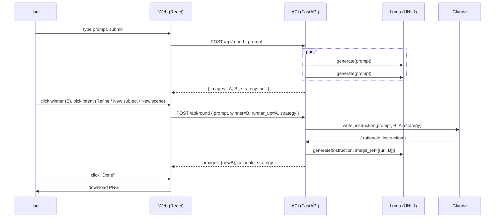

# image-morpher prototype — implementation plan

A weekend-scope prototype. User types a prompt → two parallel UNI-1
generations → click winner → pick one of three intents (Refine this
/ New subject, same look / New scene, same subject) → an LLM writes
a prompt that embodies that intent → repeat → "Done" → PNG download.

Audience: designers / mood-board creators iterating 8–15 rounds on a
single image. See `docs/project-brief.md` for product context.

Stack: Single `web/index.html` (vanilla JS, no build step), Python +
FastAPI + `luma-agents` SDK + `anthropic` SDK (backend). Localhost only.

## Problem frame

Generative image refinement loses what made earlier outputs good.
Existing tools either start from scratch on every regeneration
(Midjourney) or rely on the user knowing how to phrase
"this-but-different-in-this-specific-way" prompts. Hypothesis: when a
user prefers B over A, the *kind* of preference signal (visual style,
subject identity, surgical change) maps to a different *shape of
prompt*, and an LLM looking at both images can pick the right shape
and write the prompt. The prototype is the apparatus to test that
hypothesis; the artifact is the running code plus the findings logged
in `NOTES.md`.

Luma's agents API exposes a single image-conditioning primitive
(`image_ref`), so the routing decision happens entirely in language
— UNI-1's autoregressive reasoning is what interprets a
strategy-flavoured prompt and conditions on the anchor image
appropriately.

## Requirements trace

**Core A/B loop**

- **R1.** Text prompt → two parallel UNI-1 generations on round 0.
- **R2.** Click-to-pick A/B UI on every round.
- **R3.** Anchored loop: winner persists as A; one new candidate B is
  generated each subsequent round.

**Intent and LLM reasoning**

- **R4.** **User picks the strategy, not the LLM.** After clicking the
  winner, the user picks one of three intents that maps to a strategy:
  🎯 *Refine this* (`tweak`), 🎨 *New subject, same look*
  (`preserve_look`), 🌐 *New scene, same subject*
  (`preserve_subject`). The strategy is sent to the backend as a
  request input. (See Decision 7 for the rationale; the original
  LLM-routes design failed Unit 1's gate.)
- **R5.** LLM writes the next-round prompt given (winner, runner-up,
  prompt, **user-picked strategy**). Returns JSON
  `{rationale, instruction}`. The `instruction` is the literal prompt
  for the next UNI-1 call; `image_ref` always points at the winner
  URL (Decision 3). The rationale is shown next to B as a subtitle so
  the user can see *why* this image came out the way it did.

**Ship and findings**

- **R7.** "Done" button → PNG download. No social share.
- **R9.** Clone-and-run setup: `uv run` (backend) + `npm run dev`
  (frontend); README only.
- **R10.** A designer can run 10+ rounds in one session without the
  loop drifting away from what they liked. Per-round latency feels
  like part of the craft, not a wait.
- **R11.** `NOTES.md` captures ≥5 substantive findings about UNI-1
  and the Luma agents API, with the strongest finding leading.
  Includes a one-line read on whether the loop converged or drifted
  during the Unit 6 smoke. The API-migration finding from Unit 1's
  spike is already logged.

## Out of scope

From the brief's "v2 ideas" list:

- Ray 2 video output, image-to-video finalise
- User-uploaded starting images (would need CDN hosting)
- PDF export, branching from history, accounts, hosted deploy
- Speculative pre-generation of round N+1 to mask latency
- Mobile-first design (mobile layout is best-effort)
- Linter / formatter / mypy — one person, two weekends

Cut from a wider draft, parked as v2 candidates if the MVP earns
them:

- **Preference chip** (`mood` / `subject` / `composition` / `bolder`)
  feeding the strategy prompt — was insurance against an unproven risk;
  add only if Unit 6 shows the LLM-alone path is wobbly.
- **"Both bad" re-roll button** — escape hatch; substitute is "pick
  the less-bad one and choose `Refine this` for next round", or
  click Done.
- **History rail** with thumbnails + channel badges — visual progress
  indicator; the active pair is the only thing that affects outcomes.
- **Demo GIF in the README** — fast-follow once the prototype ships;
  record a 10-pick session and embed at the top of `README.md`.

## Commands

```
backend (api/):  uv sync · uv run uvicorn app.main:app --reload --port 8000 · uv run pytest
frontend (web/): npm install · npm run dev · npm run test · npm run build · npm run typecheck
spike (spike/):  uv run python spike/spike.py
```

Tests: `pytest` + `pytest-asyncio` + `respx` on backend; Vitest +
React Testing Library on frontend. No e2e — Unit 6's manual smoke is
the end-to-end check.

## Code style

- Python 3.11+, type hints, pydantic for cross-boundary payloads,
  `async def` for SDK calls. Errors are explicit exception classes,
  translated to typed `ErrorResponse` at the FastAPI handler.
- TypeScript strict mode. `useState` + prop drilling — no reducer, no
  Redux, no Zustand. Plain CSS — no Tailwind.
- `web/src/types.ts` mirrors `api/app/models.py` by hand. Drift is
  the most likely contract bug; keep both in PR scope when either
  changes.
- Comments explain *why*. One file per concern; don't preemptively
  split into packages.

## Boundaries

Sunday-afternoon-when-scope-creep-is-loud rules:

- Don't commit `.env` or anything containing API keys.
- Don't add a state library, UI kit, or CSS framework.
- Don't ship features outside this plan or the brief's "v2 ideas".
- Don't build a backend image proxy until Luma URL TTL actually bites.
- Run the spike (Unit 1) before writing any backend code.

## Decisions worth remembering

1. **Single endpoint.** `POST /api/round` handles both round-0 and
   round-N off the request shape (`winner_url is None` → round 0).
   Cuts duplicate client logic.
2. **Strategy is a user input, not an LLM output.** After the winner
   click, the user picks one of three intents (Refine this / New
   subject, same look / New scene, same subject) and the choice is
   sent to the backend. The LLM writes the next-round prompt
   *conditional* on that strategy. There is no override dropdown
   anymore — the picker IS the override. (See Decision 7 for why we
   moved away from LLM-as-router.)
3. **`image_ref` is always the winner; `weight` is empirical.** The
   round-N call is always
   `generate(prompt=instruction, image_ref=[{url: winner}])`. There
   is no per-strategy channel branching (the new agents API has only
   one primitive). Whether the API accepts a `weight` field on
   `image_ref` entries is open question #2; if yes, defaults live in
   `config.py` and are calibrated empirically. If no, conditioning
   strength is a prompt-only knob.
4. **`instruction` becomes the UNI-1 `prompt` on every round-N
   call.** The system prompt must require a self-contained image
   prompt (e.g. *"a vintage typewriter on a wooden desk in moodier
   lighting"*), never a constraint description. Constraint phrasing
   becomes the literal UNI-1 prompt and loses the original subject.
5. **Round-N response carries only the new B URL.** Frontend retains
   the prior winner from local state. Backend is stateless.
6. **Plain-language strategy labels in the UI.** `tweak` → "Refine
   this", `preserve_look` → "New subject, same look",
   `preserve_subject` → "New scene, same subject". Translation tables
   in `web/src/components/StrategyPicker.tsx` (button labels) and
   `web/src/components/StrategySubtitle.tsx` (B's subtitle on the
   prior round). Strategy enum values never reach the user.
7. **LLM-as-router was empirically dead-ended in Unit 1.** Original
   design had Claude pick the strategy from the two image URLs
   alone. Two gate cases (typewriter, wolf-howling-at-moon) showed
   Claude can't reliably infer user intent from pixels — even when
   it correctly identifies *why* B beat A, it can't tell whether the
   user wants that quality applied to the same subject or a new one.
   Strategy moved to explicit user input; LLM keeps the
   prompt-authoring role. Findings logged in `NOTES.md`. The original
   "≥3/5 strategy agreement" gate is retired; the new gate is "given
   a user-picked strategy, does Claude write a prompt that embodies
   it?" — measured during Unit 1's continued probing and Unit 6's
   smoke.

## Open questions to validate while building

- **Round-0 variance / jitter need.** Does UNI-1 return materially
  different images on identical prompts? The spike defaults to the
  bare prompt twice; if A and B come back near-identical, edit the
  spike to append distinct semantic modifiers (e.g. `, warm lighting`
  / `, cool lighting`). Two gotchas: neutral nonces may collapse to
  the same latent, and the jitter axis you pick frames what dimension
  A vs B is asking the user to vote on — pick deliberately.
- **Does `image_ref` accept `weight` on the new agents API?** Docs
  list `url` / `data` / `media_type` only; old API had `weight`. If
  accepted, calibrate a default empirically. If not, conditioning
  strength is a prompt-only knob ("loosely inspired by …" vs
  "matching exactly the composition of …").

Loop convergence and latency-feel are answered by *using* the
prototype during Units 5/6 — log surprises in `NOTES.md`.

## High-level design

### Round flow


```mermaid
sequenceDiagram
  participant U as User
  participant W as Web (React)
  participant A as API (FastAPI)
  participant L as Luma (UNI-1)
  participant C as Claude

  U->>W: type prompt, submit
  W->>A: POST /api/round { prompt }
  par
    A->>L: generate(prompt)
    A->>L: generate(prompt)
  end
  A-->>W: { images: [A, B], strategy: null }

  U->>W: click winner (B), pick intent (Refine / New subject / New scene)
  W->>A: POST /api/round { prompt, winner=B, runner_up=A, strategy }
  A->>C: write_instruction(prompt, B, A, strategy)
  C-->>A: { rationale, instruction }
  A->>L: generate(instruction, image_ref=[{url: B}])
  A-->>W: { images: [newB], rationale, strategy }

  U->>W: click "Done"
  W->>U: download PNG
```

### Frontend state machine

```
idle ──[submit]──▶ generating
generating ──[ok]──▶ picking
picking ──[click winner]──▶ choosing_intent
choosing_intent ──[pick intent]──▶ generating
picking ──[click "Done"]──▶ done
generating ──[error]──▶ error ──[retry]──▶ generating
```

`choosing_intent` is the moment between picking the winner and
firing the next-round request — the user picks one of three
strategy buttons. There is no separate override dropdown; the
picker is always shown.

## Agent-native design

The prototype is human-in-the-loop by default (user picks winners,
user picks strategies), but the backend is deliberately shaped so that
an agent can drive the same loop without any API changes. This section
documents the principles that keep the design agent-extensible and what
a future automated version would look like.

### Why the current design is already agent-ready

**The API is already the agent interface.** `POST /api/round` is
stateless: it takes a prompt, optionally a winner URL, runner-up URL,
and strategy, and returns image URLs. No session state, no cookies, no
UI coupling. An agent script and the React frontend make identical
requests — the endpoint cannot tell them apart.

**Strategy is a request input, not an LLM output.** The backend accepts
`strategy` as a client-supplied enum value. A human clicks a button; an
agent supplies the string. Same wire format, no API change required.

**The LLM's role is bounded to prompt-authoring.** `write_instruction()`
takes (prompt, winner, runner_up, strategy) and returns
`{rationale, instruction}`. It does not evaluate quality, pick winners,
or decide when the loop should stop. Those decisions sit above the API
layer — currently made by the human, in the future made by an agent.

### Action parity

| User action (UI) | How an agent achieves the same outcome |
|------------------|---------------------------------------|
| Type a prompt and submit | `POST /api/round { prompt }` |
| Open A and B images, pick a winner | Fetch both URLs; call Claude with vision to evaluate against a stated goal; extract the winner URL |
| Pick a strategy (Refine / New subject / New scene) | Supply `strategy` enum value in the next request, driven by the agent's own judgment or a goal-encoded heuristic |
| Click "Done" and download | Record the winner URL; `complete_task` with summary; caller downloads the PNG |

Full parity is achievable with no backend changes. The only missing
piece for an autonomous agent is **winner evaluation** — the step that
currently requires a human to open URLs and click. That belongs in agent
code above the API, not inside the API.

### What to protect during implementation

These choices preserve agent-extensibility — don't erode them:

- **Keep `POST /api/round` stateless.** No server-side session, no
  implicit "current winner" stored server-side. State flows through
  request parameters, which both the UI and an agent can supply.
- **Don't bundle winner-selection into the backend.** If you add
  automatic quality scoring or convergence detection inside the FastAPI
  handler, you've made a decision that belongs to the caller (human or
  agent). Keep the endpoint a dumb primitive.
- **Keep `strategy` as a required input for round-N, not a derived
  field.** If the backend ever auto-infers strategy when the client
  omits it, you break the agent's ability to control the loop.
- **Return raw URLs, not processed images.** The response carries Luma
  CDN URLs. An agent can inspect them with Claude vision; the UI
  displays them. If you proxy images through the backend you add
  coupling that makes the agent path harder.

### Future: agent-driven loop (v2)

A fully automated loop would look like this — no UI, no human clicks:

```
goal = "a moody oil-painting portrait of a lighthouse at dusk"
round 0: POST /api/round { prompt: goal }
         → { images: [A, B] }
evaluate: ask Claude (vision): "Given the goal, which image is closer?
          Why? What strategy would move it further toward the goal?"
         → winner=B, strategy="tweak"
round 1: POST /api/round { prompt, winner=B, runner_up=A, strategy="tweak" }
         → { images: [newB], rationale }
evaluate: same — is newB closer to the goal than B was?
          if yes → continue; if plateau → try "preserve_look"
stop: after N rounds, or when the evaluator marks the goal achieved
```

Three things to add in v2 (none require changing the existing API):

1. **`evaluate_round(goal, winner_url, new_url) -> {better, strategy, rationale}`**
   — A Claude vision call that compares the new image to the prior
   winner against the stated goal. This is the human click, automated.

2. **`complete_task(summary, winner_url)`** — An explicit completion
   signal (not heuristic detection). The agent calls this when the
   evaluator marks the goal achieved or N rounds elapse.

3. **A session log** — The agent accumulates `{round, winner_url,
   strategy, rationale}` per round so it can explain what changed and
   why. Written to a file or returned in the final summary.

### Composability check

New behaviors that can be added via prompt alone, no code changes:

- *"Explore all three strategies in parallel on round 1, pick the
  strongest result."* → Call the endpoint three times with different
  `strategy` values; evaluate all three; keep the best.
- *"Run until you have a result that passes a specific aesthetic
  criterion."* → Replace the fixed-N stop condition with an evaluator
  prompt.
- *"Summarize what changed across the full session."* → Read the
  session log and write a narrative.

---

## Implementation units

### Unit 1: Spike (Day 0 precondition)

Single-file Python spike. Validates the round-0 → strategy → round-1
loop end-to-end before any backend code.

Files: `spike/spike.py`, `spike/system_prompt.py`,
`spike/pyproject.toml`, `spike/.env.example`, `spike/README.md`,
`NOTES.md`.

Approach:

- Hardcode a prompt; call UNI-1 twice in parallel; print both URLs.
- Confirm round-0 variance is visually meaningful. If A and B look
  near-identical on the bare prompt, edit the spike to append
  distinct semantic modifiers to each call (jitter — see Open
  Questions).
- **Prompt the user for an intent at the console** after they pick
  the winner. Three options mapped to `tweak` / `preserve_look` /
  `preserve_subject`. The chosen strategy is passed to
  `write_instruction()` as input — Claude does not pick the
  strategy itself. This shape was validated during the spike's
  earlier runs: two cases (typewriter, wolf-howling-at-moon) showed
  Claude can't reliably infer user intent from images alone, so
  routing was moved to explicit user input. See Decision 7 and
  `NOTES.md` for the full reasoning.
- Run 5+ hand-picked prompts under each strategy. Eyeball whether
  Claude's `instruction` actually embodies the strategy the user
  chose (e.g., when user picks `tweak`, does the instruction stay
  close to the original subject? When user picks `preserve_look`,
  does the instruction inherit B's stylistic adjectives?).
- Probe whether `image_ref` accepts a `weight` field (open question
  #2). If yes, calibrate at 0.4 / 0.6 / 0.8 and log the trio in
  `NOTES.md`. If no, log that finding and note conditioning is
  prompt-only.

Loop convergence is not measured here — judged in real use during
Units 5/6.

Verification:

- For each user-picked strategy, Claude's instruction produces a
  round-1 image that visibly embodies the strategy on ≥3/5 cases.
  This is a *prompt-authoring* gate, not a routing gate (the routing
  gate was retired — see Decision 7).
- `NOTES.md` logs round-0 variance, per-strategy authoring quality,
  `image_ref` weight result, cold/p50 latency.

### Spike findings (logged 2026-05-13)

Empirical results from the spike runs. Architectural consequences are
already reflected in the plan (see Decision 7 and Requirements R4/R5).

**Latency — confirmed 30–60s per generation.** Round 0 (two parallel
`generate()` calls): ~46–48s. Round 1 (one serial `generate_with_anchor()`
call): ~62–63s. Original plan assumed 10–20s. An 8–15 round session is
4–15 minutes of waiting. `POLL_TIMEOUT = 180s` is sufficient (each
generation completes well within it), but latency-feel at R10 is a real
risk. Speculative pre-generation of round N+1 (v2 parking lot) becomes
more attractive as a latency mask.

**Round-0 variance — open.** A and B are generated from the same bare
prompt with no jitter. Whether they differ visibly enough to give the user
a meaningful A/B choice hasn't been confirmed by eye — URLs need to be
opened. If they come back near-identical, add distinct semantic modifiers
per the spike's comment block.

**LLM strategy routing — empirically dead-ended.** Across the two gate
cases run before this session (typewriter, wolf-howling-at-moon), Claude
misrouted both: case 1 picked `preserve_subject` when look attributes
differed; case 2 picked `preserve_look` when `tweak` was the natural call.
Re-running the case-1 prompt today returned `preserve_look` (correct) —
confirming the mislabeling is variable, not systematic. The root problem
is that the LLM can correctly identify *why* B beat A but cannot tell
*what the user wants next* from pixels alone. Strategy routing moved to
explicit user input; LLM keeps the prompt-authoring role (Decision 7).

**Instruction quality — preliminary pass.** Even when strategy labels
were wrong, Claude's written `instruction` was reasonable (case 1: rationale
described look attributes; instruction preserved look-style adjectives in
a new scene; prompt was usable). The prompt-authoring role appears
mechanically solid; the mislabeling was the only failure mode observed.

**`image_ref` weight — not yet probed.** `IMAGE_REF_WEIGHT = None` in
all runs so far. Open question #2 remains open; probe during or after Unit 2
by setting `IMAGE_REF_WEIGHT = 0.6` in `spike.py`.

**URL TTL — at least 1 hour.** Presigned S3 URLs carry `X-Amz-Expires=3600`.
Backend proxy is not needed for any session within that window.

**`luma-agents` SDK surface confirmed.** `AsyncLuma(auth_token=...)`,
`luma.generations.create(**kwargs)` → `{id, state}`, poll
`luma.generations.get(id)` until `state == "completed"`, result at
`output[0].url`. No undocumented errors. `type="image"`,
`output_format="png"`, `model="uni-1"` all accepted.

---

### Unit 2: API scaffold + Luma generate wrapper

Stand up FastAPI + a single async helper that wraps UNI-1 generation
and polling.

Files: `api/pyproject.toml`, `api/.env.example`,
`api/app/{__init__,config,luma,constants}.py`, `api/tests/test_luma.py`.

Approach:

- Deps: `fastapi`, `uvicorn[standard]`, `luma-agents`,
  `anthropic>=0.40`, `pydantic>=2`, `pydantic-settings`,
  `python-dotenv`. Dev: `pytest`, `pytest-asyncio`, `respx`.
- `config.py` (`pydantic-settings`): `LUMAAI_API_KEY`,
  `ANTHROPIC_API_KEY` (both required),
  `LUMA_MODEL` (`uni-1`), `ANTHROPIC_MODEL`
  (`claude-haiku-4-5-20251001`),
  `CORS_ORIGINS` (`["http://localhost:5173"]`),
  `NUM_OF_ROUNDS` (int, default `10`),
  `IMAGE_REF_WEIGHT` (optional float, only sent if Unit 1's
  empirical probe confirmed the field is accepted).
- `luma.py`:
  - Module-level `AsyncLuma` client (`luma-agents` SDK).
  - `async def generate(prompt: str, image_ref: list | None = None) -> str`.
    Calls `agents.lumalabs.ai/v1/generations`, polls
    `GET /v1/generations/{id}` every 2s with a 180s overall timeout.
    Raises `GenerationFailed` on `state == "failed"`,
    `GenerationTimeout` on deadline. Returns `output[0].url`.
  - `async def generate_with_anchor(written: WrittenInstruction, anchor_url) -> str`
    is a one-liner: `await generate(written.instruction,
    image_ref=[{"url": anchor_url}])` (plus weight if accepted).
    Kept as a function for symmetry with the spike, but trivial.

Tests: happy path, generation failure, timeout, round-N call passes
`image_ref` correctly.

Verification: `uv run pytest` passes; module imports cleanly.

---

### Unit 3: Pydantic models, instruction authoring, /api/round endpoint

Wire the FastAPI route. Single endpoint dispatches on request shape.

Files: `api/app/{models,strategy,system_prompt,main}.py`,
`api/tests/{test_strategy,test_main}.py`.

Approach:

- `models.py`:
  - `Strategy = Literal["preserve_look", "preserve_subject", "tweak"]`
  - `WrittenInstruction`: `rationale, instruction` (no `strategy`
    field — it came in as a request input, not an LLM output).
  - `RoundRequest`: `prompt, winner_url, runner_up_url, strategy`.
    `strategy` is required for round-N (`winner_url` is set);
    omitted/null for round 0.
  - `RoundResponse`: `images, rationale: str | None,
    strategy: Strategy | None`. The strategy echoed back is the one
    the user picked, useful for the frontend's subtitle.
  - `ErrorResponse`: `error: Literal[...], detail`.
- `system_prompt.py`: Claude system prompt as a module-level Python
  constant `SYSTEM_PROMPT`. Not loaded from a file — imported directly.
- `constants.py`: module-level constants shared across the app (e.g.
  `POLL_INTERVAL_S = 2`, `POLL_TIMEOUT_S = 180`). Keep numeric literals
  out of business logic.
- `strategy.py`: `async def write_instruction(prompt, winner,
  runner_up, strategy) -> WrittenInstruction`. Anthropic SDK; model
  from `settings.ANTHROPIC_MODEL`. Imports `SYSTEM_PROMPT` from
  `system_prompt.py`. Robust JSON extraction (regex first `{...}` block).
- `main.py` also exposes `GET /api/config` → `{"num_of_rounds":
  settings.NUM_OF_ROUNDS}`. No auth, localhost only. Frontend fetches
  this on mount so the round limit is set in one place.
- `main.py` `POST /api/round` handles two cases:
  - `winner_url is None` → round 0 (`asyncio.gather` two `generate`
    calls). Strategy is ignored.
  - Else → `write_instruction(prompt, winner, runner_up, strategy)`
    then `generate(instruction, image_ref=[{url: winner}])`.
- On failure, return typed `ErrorResponse` with appropriate 5xx.

Tests: instruction happy path under each strategy; bad-JSON;
endpoint round-0; endpoint round-N for each strategy passes the
right value through to `write_instruction`; endpoint surfaces
`GenerationFailed` as 502; round-N missing `strategy` returns 422.

Verification: `uv run pytest` passes; `curl` round-0 returns two URLs.

---

### Units 4–6: Single-file web UI

File: `web/index.html`.

Approach:

- State machine: `idle → generating → picking → choosing_intent →
  generating → … → done`. Managed as a plain JS variable; a single
  `show(sectionId)` function swaps visible `<section>` elements.
- `fetch('http://localhost:8000/api/round', { method: 'POST', … })`
  for all API calls. Errors surface as a red message above the active
  section. No retry button — user stays on the current section and
  can try again.
- `NUM_ROUNDS = 10` hardcoded in JS.
- Round 0: submit prompt → `generating` → show two images side-by-side
  → `picking`. No rationale shown.
- Click A or B: stash `pendingWinner` / `pendingRunnerUp` → `choosing_intent`.
  Three strategy buttons: 🎯 Refine this (`tweak`) · 🎨 New subject,
  same look (`preserve_look`) · 🌐 New scene, same subject
  (`preserve_subject`).
- Strategy click: → `generating` → POST round-N → `urlA = pendingWinner`,
  `urlB = response.images[0]`, `roundNumber++` → `picking`. Rationale
  shown below B.
- Done button: visible from round 1+; primary CTA when
  `roundNumber >= NUM_ROUNDS`. Opens winner URL in new tab
  (`target="_blank"`). Cross-origin `download` attribute works in
  some browsers; others require Cmd/Ctrl+S. No proxy.
- Done state: winner image + open-link + "Start over".
- Loading: plain "Generating…" text. No skeleton shimmer.
- Dark background, flat CSS, no external dependencies.
- Served with `python -m http.server 5173` from `web/` — matches
  the backend's `CORS_ORIGINS` default, no backend changes needed.

Verification: manual smoke — prompt → 10 picks → done → image opens
in new tab. Different strategies used. Loop stays coherent.

## Risks

| Risk | Mitigation | Spike result |
|------|------------|--------------|
| UNI-1 returns near-identical images on identical prompts. | Unit 1 validates. Distinct semantic seeds on round 0 if needed. | **Open.** URLs generated but not yet eyeballed. Check before closing Unit 1. |
| LLM strategy selection is shaky. | ~~Unit 1 gate: ≥3/5 agreement on obvious cases. If <3/5, sharpen prompt / pivot README narrative / demote LLM step.~~ Strategy is now a user input (Decision 7). | **Closed — root cause eliminated.** Cases 1–2 confirmed LLM can't infer user intent from pixels. Routing moved to explicit user picker; LLM is prompt-author only. |
| UNI-1 latency feels slow at round 12. | Skeleton shimmer + elapsed-seconds tick. Speculative pre-gen is v2. | **Confirmed and worse than assumed.** Round 0 ~48s, round N ~63s (vs 10–20s planned). An 8–15 round session is 4–15 min of waiting. Shimmer + tick still the mitigation; pre-gen is more attractive now. |
| Loop oscillates instead of converging. | Note in `NOTES.md` during the Unit 6 smoke. If endemic, document the failure as the headline finding. | **Open.** Judged during Unit 6 smoke. |
| Luma URLs expire mid-session. | Unit 1 confirms TTL ≥ 1 hour. README documents it; no proxy. | **Mitigated.** Presigned S3 URLs carry `X-Amz-Expires=3600`. Proxy not needed for any session in that window. |
| Pydantic ↔ TypeScript drift. | Keep both files in PR scope when either changes. | Not yet applicable (Units 2–4 not started). |
| Anthropic model deprecated by run-time. | `ANTHROPIC_MODEL` is configurable via `.env`. | Not yet applicable. |

## References

- Brief: `docs/project-brief.md`
- Spike: `spike/spike.py` (canonical reference for polling and
  request shape)
- Luma agents API guide:
  https://docs.agents.lumalabs.ai/guides/image-generation/
- Luma agents Python SDK: https://docs.agents.lumalabs.ai/api/python
- Anthropic SDK: https://docs.anthropic.com/en/api/getting-started
- Verified Luma agents API surface:
  - `POST agents.lumalabs.ai/v1/generations` returns `201` with
    `{id, state: "queued"}`. Poll `GET .../v1/generations/{id}` until
    `state == "completed"`; the result URL is at `output[0].url`.
  - `image_ref`: array of up to 9 entries, each `{url}` *or*
    `{data, media_type}`. The only image-conditioning primitive on
    this API; UNI-1 reads the reference's role from the prompt.
  - Result URLs are presigned and expire ~1 hour after generation.
  - UNI-1 has no public seed parameter — round-0 variance comes from
    prompt jitter or model nondeterminism.
