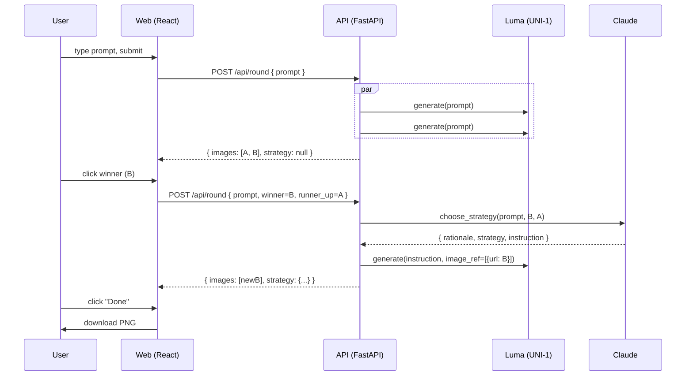

# image-morpher prototype — implementation plan

A weekend-scope prototype. User types a prompt → two parallel UNI-1
generations → click winner → an LLM picks one of three prompt
*strategies* (`preserve_look` / `preserve_subject` / `tweak`) and
writes a strategy-flavoured prompt for the next round → user can
override the strategy → repeat → "Done" → PNG download.

Audience: designers / mood-board creators iterating 8–15 rounds on a
single image. See `docs/project-brief.md` for product context.

Stack: React + Vite + TypeScript (frontend), Python + FastAPI +
`luma-agents` SDK + `anthropic` SDK (backend). Localhost only.

## Problem frame

Generative image refinement loses what made earlier outputs good.
Existing tools either start from scratch on every regeneration
(Midjourney) or rely on the user knowing how to phrase
"this-but-different-in-this-specific-way" prompts. Hypothesis: when a
user prefers B over A, the *kind* of preference signal (visual style,
subject identity, surgical change) maps to a different *shape of
prompt*, and an LLM looking at both images can pick the right shape
and write the prompt. The prototype is the apparatus to test that
hypothesis; the artifact is the running code plus the findings logged
in `NOTES.md`.

Luma's current agents API exposes only one image-conditioning
primitive (`image_ref`), so the routing decision happens entirely in
language — UNI-1's autoregressive reasoning is what interprets a
strategy-flavoured prompt and conditions on the anchor image
appropriately. The original draft assumed the older Dream Machine API
with three distinct channels (`style_ref` / `character_ref` /
`modify_image_ref`); that API was deprecated for new keys before this
build started. The spike (Unit 1) surfaced the migration on day 0.

## Requirements trace

**Core A/B loop**

- **R1.** Text prompt → two parallel UNI-1 generations on round 0.
- **R2.** Click-to-pick A/B UI on every round.
- **R3.** Anchored loop: winner persists as A; one new candidate B is
  generated each subsequent round.

**LLM reasoning**

- **R4.** LLM strategy selection per round, returning JSON
  `{rationale, strategy, instruction}` with `strategy ∈
  {preserve_look, preserve_subject, tweak}`. The `instruction` is the
  literal prompt for the next UNI-1 call; `image_ref` always points
  at the winner URL (Decision 3).
- **R5.** Chosen strategy and rationale revealed *after* B generates,
  surfaced via plain-language label (Decision 6). Override dropdown
  applies to the next round, not the current one — the user's escape
  hatch when Claude misroutes.

**Ship and findings**

- **R7.** "Done" button → PNG download. No social share.
- **R9.** Clone-and-run setup: `uv run` (backend) + `npm run dev`
  (frontend); README only.
- **R10.** A designer can run 10+ rounds in one session without the
  loop drifting away from what they liked. Per-round latency feels
  like part of the craft, not a wait.
- **R11.** `NOTES.md` captures ≥5 substantive findings about UNI-1
  and the Luma agents API, with the strongest finding leading.
  Includes a one-line read on whether the loop converged or drifted
  during the Unit 6 smoke. The API-migration finding from Unit 1's
  spike is already logged.

## Out of scope

From the brief's "v2 ideas" list:

- Ray 2 video output, image-to-video finalise
- User-uploaded starting images (would need CDN hosting)
- PDF export, branching from history, accounts, hosted deploy
- Speculative pre-generation of round N+1 to mask latency
- Mobile-first design (mobile layout is best-effort)
- Linter / formatter / mypy — one person, two weekends

Cut from a wider draft, parked as v2 candidates if the MVP earns
them:

- **Preference chip** (`mood` / `subject` / `composition` / `bolder`)
  feeding the strategy prompt — was insurance against an unproven risk;
  add only if Unit 6 shows the LLM-alone path is wobbly.
- **"Both bad" re-roll button** — escape hatch; substitute is "pick
  the less-bad one and override for next round", or click Done.
- **History rail** with thumbnails + channel badges — visual progress
  indicator; the active pair is the only thing that affects outcomes.
- **Demo GIF in the README** — fast-follow once the prototype ships;
  record a 10-pick session and embed at the top of `README.md`.

## Commands

```
backend (api/):  uv sync · uv run uvicorn app.main:app --reload --port 8000 · uv run pytest
frontend (web/): npm install · npm run dev · npm run test · npm run build · npm run typecheck
spike (spike/):  uv run python spike/spike.py
```

Tests: `pytest` + `pytest-asyncio` + `respx` on backend; Vitest +
React Testing Library on frontend. No e2e — Unit 6's manual smoke is
the end-to-end check.

## Code style

- Python 3.11+, type hints, pydantic for cross-boundary payloads,
  `async def` for SDK calls. Errors are explicit exception classes,
  translated to typed `ErrorResponse` at the FastAPI handler.
- TypeScript strict mode. `useState` + prop drilling — no reducer, no
  Redux, no Zustand. Plain CSS — no Tailwind.
- `web/src/types.ts` mirrors `api/app/models.py` by hand. Drift is
  the most likely contract bug; keep both in PR scope when either
  changes.
- Comments explain *why*. One file per concern; don't preemptively
  split into packages.

## Boundaries

Sunday-afternoon-when-scope-creep-is-loud rules:

- Don't commit `.env` or anything containing API keys.
- Don't add a state library, UI kit, or CSS framework.
- Don't ship features outside this plan or the brief's "v2 ideas".
- Don't build a backend image proxy until Luma URL TTL actually bites.
- Run the spike (Unit 1) before writing any backend code.

## Decisions worth remembering

1. **Single endpoint.** `POST /api/round` handles both round-0 and
   round-N off the request shape (`winner_url is None` → round 0).
   Cuts duplicate client logic.
2. **Override skips Claude.** When the user has set an override
   strategy, the backend builds a synthetic `StrategyChoice`
   (`instruction = prompt`, `strategy = override`) and skips the LLM.
   Acceptable cost: override mode reuses the original prompt rather
   than authoring a strategy-flavoured one, so output drift is small
   round-over-round. Users who override have explicitly opted out of
   LLM authorship.
3. **`image_ref` is always the winner; `weight` is empirical.** The
   round-N call is always
   `generate(prompt=instruction, image_ref=[{url: winner}])`. There
   is no per-strategy channel branching (the new agents API has only
   one primitive). Whether the API accepts a `weight` field on
   `image_ref` entries is open question #2; if yes, defaults live in
   `config.py` and are calibrated empirically. If no, conditioning
   strength is a prompt-only knob.
4. **`instruction` becomes the UNI-1 `prompt` on every round-N
   call.** The system prompt must require a self-contained image
   prompt (e.g. *"a vintage typewriter on a wooden desk in moodier
   lighting"*), never a constraint description. Constraint phrasing
   becomes the literal UNI-1 prompt and loses the original subject.
5. **Round-N response carries only the new B URL.** Frontend retains
   the prior winner from local state. Backend is stateless.
6. **Plain-language strategy labels in the UI.** `preserve_look` →
   "Keep the look", `preserve_subject` → "Keep the subject", `tweak`
   → "Tweak it". Translation table in
   `web/src/components/StrategySubtitle.tsx`. Strategy enum values
   never reach the user.
## Open questions to validate while building

- **Round-0 variance / jitter need.** Does UNI-1 return materially
  different images on identical prompts? The spike defaults to the
  bare prompt twice; if A and B come back near-identical, edit the
  spike to append distinct semantic modifiers (e.g. `, warm lighting`
  / `, cool lighting`). Two gotchas: neutral nonces may collapse to
  the same latent, and the jitter axis you pick frames what dimension
  A vs B is asking the user to vote on — pick deliberately.
- **Does `image_ref` accept `weight` on the new agents API?** Docs
  list `url` / `data` / `media_type` only; old API had `weight`. If
  accepted, calibrate a default empirically. If not, conditioning
  strength is a prompt-only knob ("loosely inspired by …" vs
  "matching exactly the composition of …").

Loop convergence and latency-feel are answered by *using* the
prototype during Units 5/6 — log surprises in `NOTES.md`.

## High-level design

### Round flow


```mermaid
sequenceDiagram
  participant U as User
  participant W as Web (React)
  participant A as API (FastAPI)
  participant L as Luma (UNI-1)
  participant C as Claude

  U->>W: type prompt, submit
  W->>A: POST /api/round { prompt }
  par
    A->>L: generate(prompt)
    A->>L: generate(prompt)
  end
  A-->>W: { images: [A, B], strategy: null }

  U->>W: click winner (B)
  W->>A: POST /api/round { prompt, winner=B, runner_up=A }
  A->>C: choose_strategy(prompt, B, A)
  C-->>A: { rationale, strategy, instruction }
  A->>L: generate(instruction, image_ref=[{url: B}])
  A-->>W: { images: [newB], strategy: {...} }

  U->>W: click "Done"
  W->>U: download PNG
```

### Frontend state machine

```
idle ──[submit]──▶ generating
generating ──[ok]──▶ picking
picking ──[click winner]──▶ generating  (sends pendingOverride if set)
picking ──[click "Done"]──▶ done
generating ──[error]──▶ error ──[retry]──▶ generating
```

In `picking`, the override dropdown is input-only. `pendingOverride`
resets after each round-N submit.

## Implementation units

### Unit 1: Spike (Day 0 precondition)

Single-file Python spike. Validates the round-0 → strategy → round-1
loop end-to-end before any backend code. Acts as the go/no-go gate
on the core hypothesis.

Files: `spike/spike.py`, `spike/system_prompt.py`,
`spike/pyproject.toml`, `spike/.env.example`, `spike/README.md`,
`NOTES.md`.

Approach:

- Hardcode a prompt; call UNI-1 twice in parallel; print both URLs.
- Confirm round-0 variance is visually meaningful. If A and B look
  near-identical on the bare prompt, edit the spike to append
  distinct semantic modifiers to each call (jitter — see Open
  Questions).
- On 5 hand-picked A/B pairs where the right strategy feels obvious
  to you, check whether Claude agrees ≥3 times.
- Probe whether `image_ref` accepts a `weight` field (open question
  #2). If yes, calibrate at 0.4 / 0.6 / 0.8 and log the trio in
  `NOTES.md`. If no, log that finding and note conditioning is
  prompt-only.

Loop convergence is not measured here — judged in real use during
Units 5/6.

Verification (go/no-go):

- ≥3/5 strategy agreement on hand-picked obvious cases. If <3/5,
  decide before Unit 2: sharpen the prompt, pivot the README
  narrative, or demote the LLM step to a simpler A/B refiner.
- `NOTES.md` logs round-0 variance, strategy agreement count,
  `image_ref` weight result, cold/p50 latency, and the API-migration
  finding.

---

### Unit 2: API scaffold + Luma generate wrapper

Stand up FastAPI + a single async helper that wraps UNI-1 generation
and polling.

Files: `api/pyproject.toml`, `api/.env.example`,
`api/app/{__init__,config,luma}.py`, `api/tests/test_luma.py`.

Approach:

- Deps: `fastapi`, `uvicorn[standard]`, `luma-agents`,
  `anthropic>=0.40`, `pydantic>=2`, `pydantic-settings`,
  `python-dotenv`. Dev: `pytest`, `pytest-asyncio`, `respx`.
- `config.py` (`pydantic-settings`): `LUMAAI_API_KEY`,
  `ANTHROPIC_API_KEY` (both required),
  `LUMA_MODEL` (`uni-1`), `ANTHROPIC_MODEL`
  (`claude-haiku-4-5-20251001`),
  `CORS_ORIGINS` (`["http://localhost:5173"]`).
  Plus `IMAGE_REF_WEIGHT` (optional float, only sent if Unit 1's
  empirical probe confirmed the field is accepted).
- `luma.py`:
  - Module-level `AsyncLuma` client (`luma-agents` SDK).
  - `async def generate(prompt: str, image_ref: list | None = None) -> str`.
    Calls `agents.lumalabs.ai/v1/generations`, polls
    `GET /v1/generations/{id}` every 2s with a 180s overall timeout.
    Raises `GenerationFailed` on `state == "failed"`,
    `GenerationTimeout` on deadline. Returns `output[0].url`.
  - `async def generate_with_anchor(strategy_choice, anchor_url) -> str`
    is a one-liner: `await generate(strategy_choice.instruction,
    image_ref=[{"url": anchor_url}])` (plus weight if accepted).
    Kept as a function for symmetry with the spike, but trivial.

Tests: happy path, generation failure, timeout, round-N call passes
`image_ref` correctly.

Verification: `uv run pytest` passes; module imports cleanly.

---

### Unit 3: Pydantic models, strategy selection, /api/round endpoint

Wire the FastAPI route. Single endpoint dispatches on request shape.

Files: `api/app/{models,strategy,main}.py`,
`api/tests/{test_strategy,test_main}.py`.

Approach:

- `models.py`:
  - `Strategy = Literal["preserve_look", "preserve_subject", "tweak"]`
  - `StrategyChoice`: `rationale, strategy, instruction`.
  - `RoundRequest`: `prompt, winner_url, runner_up_url, override_strategy`.
  - `RoundResponse`: `images, strategy: StrategyChoice | None`.
  - `ErrorResponse`: `error: Literal[...], detail`.
- `strategy.py`: `async def choose_strategy(prompt, winner, runner_up) ->
  StrategyChoice`. Anthropic SDK; model from `settings.ANTHROPIC_MODEL`.
  System prompt teaches the three strategies and how each shapes the
  `instruction`. Robust JSON extraction (regex first `{...}` block).
- `main.py` `POST /api/round` handles three cases:
  - `winner_url is None` → round 0 (`asyncio.gather` two `generate`
    calls).
  - `override_strategy` set → synthetic `StrategyChoice`
    (`instruction = request.prompt`); skip Claude.
  - Else → `choose_strategy` then `generate_with_anchor`.
- On failure, return typed `ErrorResponse` with appropriate 5xx.

Tests: strategy happy path; strategy bad-JSON; endpoint round-0;
endpoint round-N; endpoint override path skips `choose_strategy`;
endpoint surfaces `GenerationFailed` as 502.

Verification: `uv run pytest` passes; `curl` round-0 returns two URLs.

---

### Unit 4: Web scaffold + round-0 flow

React + Vite app with state machine, prompt input, image-pair
display, click-to-pick. Round 0 only — no LLM rationale yet.

Files: `web/{package.json, tsconfig.json, vite.config.ts, index.html,
.env.example}`, `web/src/{main,App,types,api}.{ts,tsx}`,
`web/src/components/{PromptInput,ImagePair}.tsx`, `web/src/styles.css`,
`web/src/{api.test.ts, App.test.tsx}`.

Approach:

- `npm create vite@latest -- --template react-ts`. Strip boilerplate.
- `types.ts` mirrors `api/app/models.py` by hand. `Strategy` is a
  `Literal` of three string values; `StrategyChoice` carries
  `rationale`, `strategy`, `instruction`.
- `api.ts` exposes `postRound(req): Promise<RoundResponse>`. On
  non-2xx, parse `ErrorResponse`, throw `Error` carrying the
  `error` discriminator.
- `App.tsx` holds the state machine via `useState`.
- `PromptInput`: controlled textarea + submit, visible only in
  `idle`. One example prompt, one line of orientation copy.
- `ImagePair`: A and B side-by-side. Aspect-ratio placeholders so
  layout doesn't shift on load. Stacked vertically below ~640px.
- `styles.css`: flat CSS, dark background, generous spacing.

Tests: api-client happy path + error envelope; round-0 flow
(submit → both images render → state advances to `picking`);
click-to-pick records the choice.

Verification: `npm run dev` shows working round-0 against a running
backend; `npm run test` passes.

---

### Unit 5: Round-N flow, strategy subtitle, override

Full anchored loop with plain-language strategy surfacing and
next-round override.

Files: modify `App.tsx`, `ImagePair.tsx`, `styles.css`,
`App.test.tsx`. Create `StrategySubtitle.tsx` and its test.

Approach:

- Click winner: set `currentPair.a = winner`, clear `currentPair.b`,
  transition to `generating`. Fire `postRound({prompt, winner,
  runner_up, override_strategy: pendingOverride})`. Reset
  `pendingOverride` after firing.
- Round-N response: set `currentPair.b = response.images[0]`,
  `currentStrategy = response.strategy`. Transition to `picking`.
- `StrategySubtitle`: hidden on round 0 via `visibility: hidden` with
  `min-height` (do *not* `display: none` — collapses layout). Round
  N+: plain-language label + rationale truncated to ~140 chars,
  expandable. Override `<select>`: Auto / Keep the look / Keep the
  subject / Tweak it. Pending-override badge when set.

Tests: round-N flow renders new B + strategy subtitle; override
applies to next round; pending override resets after use; clears on
"Done"; StrategySubtitle hidden on round 0; strategy-name translation
never exposes the enum value.

Verification: manual loop — pick 10 in a row; loop stays coherent;
strategy subtitle updates each round.

---

### Unit 6: Done flow, error states, README, ship

PNG export, error states with retry, README, NOTES.md final pass.

Files: create `DoneButton.tsx`, `ErrorBanner.tsx`. Modify `App.tsx`,
`styles.css`. Create `README.md`. Modify `NOTES.md`.

Approach:

- `DoneButton`: visible from round 1+. Anchor with
  `href={winner_url}`, `target="_blank"`, `rel="noopener"`,
  `download="image-morpher-{timestamp}.png"`. Cross-origin download
  works in some browsers; others open in a new tab where the user
  Cmd/Ctrl+S's. README documents both. No `fetch+blob`, no proxy.
  On `done`: shows "Start over". No social share.
- `ErrorBanner`: renders when `state.error` is set. Raw
  `error.message` + Retry button that re-fires the last request from
  cached args. No per-error-type copy.
- Loading polish: skeleton shimmer on placeholder; "UNI-1's still
  thinking…" tick after 5s.
- `README.md` (blog-post tone): what this is, who it's for,
  quickstart, how it works (gradient-descent + prompt-strategy
  routing on a single `image_ref`), saving your output, what I
  learned (link to `NOTES.md` with the headline finding teased),
  v2 / out of scope.
- `NOTES.md` final pass: ≥5 substantive findings. Edit so the
  strongest leads. Must include: a one-line read on whether the loop
  converged or drifted across the smoke session, the `image_ref`
  weight finding from Unit 1, and the API-migration finding.

Tests: Save-image anchor renders correctly; `ErrorBanner` renders +
retry recovers; Done state shows Start over.

Verification: manual smoke — prompt → 10 picks → done. PNG
downloads. Loop stays coherent. ≥1 pick uses an override. Force
network error in devtools — banner appears, retry recovers. README's
quickstart works on a fresh clone.

## Risks

| Risk | Mitigation |
|------|------------|
| UNI-1 returns near-identical images on identical prompts. | Unit 1 validates. Distinct semantic seeds on round 0 if needed. |
| LLM strategy selection is shaky. | Unit 1 gate: ≥3/5 agreement on obvious cases. If <3/5, sharpen prompt / pivot README narrative / demote LLM step. |
| UNI-1 latency feels slow at round 12. | Skeleton shimmer + elapsed-seconds tick. Speculative pre-gen is v2. |
| Loop oscillates instead of converging. | Note in `NOTES.md` during the Unit 6 smoke. If endemic, document the failure as the headline finding. |
| Luma URLs expire mid-session. | Unit 1 confirms TTL ≥ ~30 min. README documents it; no proxy. |
| Pydantic ↔ TypeScript drift. | Keep both files in PR scope when either changes. |
| Anthropic model deprecated by run-time. | `ANTHROPIC_MODEL` is configurable via `.env`. |

## References

- Brief: `docs/project-brief.md`
- Spike: `spike/spike.py` (canonical reference for polling and
  request shape)
- Luma agents API guide:
  https://docs.agents.lumalabs.ai/guides/image-generation/
- Luma agents Python SDK: https://docs.agents.lumalabs.ai/api/python
- Anthropic SDK: https://docs.anthropic.com/en/api/getting-started
- Verified Luma agents API surface:
  - `POST agents.lumalabs.ai/v1/generations` returns `201` with
    `{id, state: "queued"}`. Poll `GET .../v1/generations/{id}` until
    `state == "completed"`; the result URL is at `output[0].url`.
  - `image_ref`: array of up to 9 entries, each `{url}` *or*
    `{data, media_type}`. The only image-conditioning primitive on
    this API; UNI-1 reads the reference's role from the prompt.
  - Result URLs are presigned and expire ~1 hour after generation.
  - UNI-1 has no public seed parameter — round-0 variance comes from
    prompt jitter or model nondeterminism.
- The older Dream Machine API (`api.lumalabs.ai/dream-machine/...`,
  `photon-1` model, separate `style_ref` / `character_ref` /
  `modify_image_ref` channels) is deprecated for new keys. Don't use
  it.
